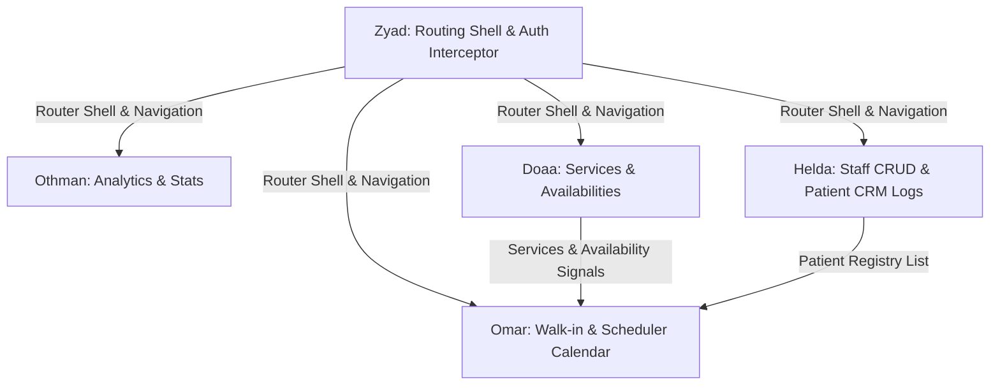

# Clarity Clinic — Staff Dashboard Angular Developer Guide

Welcome to the Angular developer guide for the Clarity Clinic Staff Dashboard. This document outlines the standalone architecture, Signals-based state management, global translation/toast services, and provides individual task breakdowns for the dashboard development team.

---

## 1. Technical Architecture

The Staff Dashboard is an internal control panel built on **Angular 21** and **Tailwind CSS v4**.

* **Standalone Architecture**: Every component, directive, and pipe is standalone. Router configurations are lazy-loaded within `src/app/routes.ts`.
* **State Management (Signals)**: Core states utilize fine-grained **Angular Signals** (`writable` signals, computed signals, and effects) instead of RxJS observables where simple data binding is concerned.
* **Services Layer**: Injected singletons handle data calls:
  * `ApiService` ([api.service.ts](file:///e:/Courses/Next%20Academy/Graduation%20Project/staff-dashboard/src/app/core/services/api.service.ts)): Strongly typed Observables that resolve HTTP calls.
  * `AuthService` ([auth.service.ts](file:///e:/Courses/Next%20Academy/Graduation%20Project/staff-dashboard/src/app/core/services/auth.service.ts)): Manages session token signals.
  * `ToastService` ([toast.service.ts](file:///e:/Courses/Next%20Academy/Graduation%20Project/staff-dashboard/src/app/core/services/toast.service.ts)): Wraps Toast configurations.
* **HTTP Interceptor**: `authInterceptor` attaches the JWT Bearer header dynamically to outgoing API requests.

---

## 2. Global Services & Utilities

### A. Toast Notifications
We wrap the third-party `ngx-toastr` library inside `ToastService`. Inject it inside components:
```typescript
import { ToastService } from '../core/services/toast.service';

constructor(private toast: ToastService) {}

// Triggers
this.toast.success('Patient status set to Arrived!');
this.toast.error('Unable to delete service.');
this.toast.info('Session updated.');
```

### B. Internationalization (i18n)
We use `@ngx-translate/core` to handle dual-language layouts (AR / EN) with dynamic directionality:
* **Translation Files**: Update keys inside `public/assets/i18n/en.json` and `ar.json`.
* **Templates Usage**: Use the `translate` pipe:
  ```html
  <h1>{{ 'dashboard.welcome' | translate }}</h1>
  ```
* **RTL Layout**: The switcher sets `<html lang="ar" dir="rtl">`. Keep layout code flexible by styling with logical padding/margins (e.g. `ps-4`, `pe-6`, `text-start`) instead of left/right absolute coordinates.

### C. Theme Configuration (Dark / Light)
Our styling variables reside inside [styles.css](file:///e:/Courses/Next%20Academy/Graduation%20Project/staff-dashboard/src/styles.css). 
* **Rule**: Toggle theme by utilizing the global `<app-theme-toggle>` component. Do not write `dark:` Tailwind directives in HTML layouts; instead, reference semantic class coordinates:
  ```html
  <!-- ✅ CORRECT -->
  <div class="bg-surface text-text border-border">Content</div>

  <!-- ❌ INCORRECT -->
  <div class="bg-white dark:bg-slate-900 text-black dark:text-white">Content</div>
  ```

---

## 3. Shared Components Matrix (Signal API)

All shared components use the new Angular Signals-based API. Zyad maintains these modules. Do not edit them directly.

| Selector | File Path | Input / Output Signatures | Consuming Developers |
|:---|:---|:---|:---|
| **app-button** | [button.component.ts](file:///e:/Courses/Next%20Academy/Graduation%20Project/staff-dashboard/src/app/shared/components/button.component.ts) | `disabled = input<boolean>()`<br>`customClass = input<string>()`<br>`clicked = output<MouseEvent>()` | Zyad, Othman, Omar, Doaa, Helda |
| **app-input** | [input.component.ts](file:///e:/Courses/Next%20Academy/Graduation%20Project/staff-dashboard/src/app/shared/components/input.component.ts) | Form control directives,<br>`label = input<string>()`<br>`error = input<string>()` | Zyad, Othman, Omar, Doaa, Helda |
| **app-select** | [select.component.ts](file:///e:/Courses/Next%20Academy/Graduation%20Project/staff-dashboard/src/app/shared/components/select.component.ts) | Form control directives,<br>`label = input<string>()`<br>`options = input<Array>()` | Omar, Doaa, Helda |
| **app-badge** | [badge.component.ts](file:///e:/Courses/Next%20Academy/Graduation%20Project/staff-dashboard/src/app/shared/components/badge.component.ts) | `customClass = input<string>()` | Omar, Doaa, Helda |
| **app-data-table**|[data-table.component.ts](file:///e:/Courses/Next%20Academy/Graduation%20Project/staff-dashboard/src/app/shared/components/data-table.component.ts)| `columns = input<string[]>()`<br>`data = input<any[]>()` | Doaa, Helda |
| **app-feedback-states**|[feedback-states.component.ts](file:///e:/Courses/Next%20Academy/Graduation%20Project/staff-dashboard/src/app/shared/components/feedback-states.component.ts)| Visual empty/error/loading container | Omar, Doaa, Helda |
| **app-theme-toggle**|[theme-toggle.component.ts](file:///e:/Courses/Next%20Academy/Graduation%20Project/staff-dashboard/src/app/shared/components/theme-toggle.component.ts)| Central self-contained theme switcher | Zyad, Othman, Omar, Doaa, Helda |
| **app-dashboard-section**|[dashboard-section.component.ts](file:///e:/Courses/Next%20Academy/Graduation%20Project/staff-dashboard/src/app/shared/components/dashboard-section.component.ts)| `sectionTitle = input<string>()`<br>`sectionSubtitle = input<string>()` | Othman |
| **app-table-actions**|[table-actions.component.ts](file:///e:/Courses/Next%20Academy/Graduation%20Project/staff-dashboard/src/app/shared/components/table-actions.component.ts)| `showView = input<boolean>()`<br>`showEdit = input<boolean>()`<br>`showDelete = input<boolean>()`<br>`view = output()`, `edit = output()`, `delete = output()` | Doaa, Helda |
| **app-avatar** | [avatar.component.ts](file:///e:/Courses/Next%20Academy/Graduation%20Project/staff-dashboard/src/app/shared/components/avatar.component.ts) | `name = input<string>()`<br>`size = input<'sm'\|'md'\|'lg'>()` | Zyad, Othman, Omar, Helda |

---

## 4. Deep Developer Tasks Reference

### Zyad — Shell Framework & Auth Guards
* **Goal**: Establish routes, Interceptors, base page dashboard structures, and authentication logic.
* **Files to Edit / Build**:
  * Implement authentication session triggers inside [auth.service.ts](file:///e:/Courses/Next%20Academy/Graduation%20Project/staff-dashboard/src/app/core/services/auth.service.ts).
  * Build the staff Login UI view features inside `features/auth/`.
  * Maintain Shell layouts inside [dashboard-layout.component.ts](file:///e:/Courses/Next%20Academy/Graduation%20Project/staff-dashboard/src/app/layouts/dashboard-layout/dashboard-layout.component.ts), header, and sidebar components.
* **API Endpoints**:
  * `POST /api/auth/login`: Authenticate staff credentials, save token, set session signals.

### Othman — Dashboard Core & Reports
* **Goal**: Build the general metrics panel dashboard view and Admin reports charts.
* **Files to Edit / Build**:
  * Build page dashboard layout inside `features/dashboard/`.
  * Build reports view panel inside `features/reports/`.
* **API Endpoints**:
  * `GET /api/dashboard/stats`: Retrieve operational totals.
  * `GET /api/admin/reports`: Query revenue charts details.
* **Component Usage**:
  * **Dashboard**: Bind outputs to `<app-stat-card>` and sections to `<app-dashboard-section>`.
  * **Reports**: Fetch reports data and plot charts.

### Omar — Scheduler & Walk-in Bookings
* **Goal**: Implement calendar schedules for receptionists and walk-in front desk booking.
* **Files to Edit / Build**:
  * Build receptionist calendar dashboard inside `features/calendar/`.
  * Build Walk-in booking screen inside `features/walk-in/`.
* **API Endpoints**:
  * `GET /api/appointments`: Fetch appointments list.
  * `POST /api/appointments/walk-in`: Save walk-in bookings (requires patient details, date, time slot, doctorId, serviceId).
* **Component Usage**:
  * **Calendar**: Render slots on list cards.
  * **Walk-In**: Bind input fields using `<app-input>`, `<app-select>`, and trigger saving via `<app-button>`. Trigger Toast success on complete.

### Doaa — Services CRUD & Availabilities
* **Goal**: Manage service catalogs and enable doctors to set working schedule configurations.
* **Files to Edit / Build**:
  * Build CRUD panel views inside `features/services/`.
  * Build Availability manager views inside `features/availability/`.
* **API Endpoints**:
  * `GET/POST/PUT/DELETE /api/services`: Execute full services catalog CRUD actions.
  * `GET/PUT /api/doctors/{id}/availability`: Read and write doctor weekly working availability shifts.
* **Component Usage**:
  * **Services**: Consume `<app-data-table>` and bind actions using `<app-table-actions>` output triggers.
  * **Availability**: Use `<app-tabs>` to separate days, and bind times using `<app-input>`.

### Helda — Staff CRUD & Patient CRM Logs
* **Goal**: Manage internal users and patient clinical history CRM lists.
* **Files to Edit / Build**:
  * Build Staff manager views inside `features/staff/`.
  * Build Patient CRM files view inside `features/patients/`.
* **API Endpoints**:
  * `GET /api/admin/staff`: List staff users.
  * `POST /api/admin/doctors` & `POST /api/admin/receptionists`: Add staff records.
  * `PUT /api/admin/staff/{id}/active`: Toggle status.
  * `GET /api/patients`: Search patient profiles.
  * `GET /api/patients/{id}/history`: Fetch clinical prescription histories.
* **Component Usage**: Render lists on `<app-data-table>`, use `<app-search-input>` to filter fields, and launch dialog forms inside `<app-modal>`.

---

## 5. Dependencies & Parallel Work Strategy

To ensure our team of 5 developers can build the internal staff dashboard in parallel without blocking each other, we utilize a **Contract-First & Bypass-First** architecture.

### A. Team Dependency Mapping



* **Zyad** (Core Framework): Manages `dashboard-layout` navigation sidebar and routes setup.
* **Doaa** (Services & Availability): Provides the core schedule schemas. **Omar** requires these to display available slots on the calendar and select service types during walk-in booking.
* **Helda** (Staff & Patients CRM): Owns the patient registration details. **Omar** depends on these lists so receptionists can search and select patients for walk-in bookings.
* **Omar** (Walk-in & Scheduler): Integrates components and services from Doaa and Helda.

---

### B. Parallel Playbook: What to Do

Use the following strategies to build your dashboard features concurrently:

#### 1. Route Bypassing (Working without Shell Layouts)
If Zyad is modifying the dashboard sidebar, auth guards, or main interceptor, do not let it halt your workflow. You can bypass active guards or navigate directly to your feature path.
* **How-to**: 
  1. Temporarily disable the `authGuard` check in `src/app/routes.ts` by editing the route configuration:
     ```typescript
     // Temporary bypass in routes.ts
     export const routes: Routes = [
       {
         path: 'walk-in',
         loadComponent: () => import('./features/walk-in/walk-in.component').then(m => m.WalkInComponent),
         // canActivate: [authGuard] <-- Comment out during local development
       }
     ];
     ```
  2. Open your browser directly to `http://localhost:4200/walk-in` to run and style your UI component in isolation.

#### 2. Model-First Sharing (`src/app/core/models/`)
Omar, Doaa, and Helda must agree on data models early so they don't break each other's types during integration. All models must be declared inside the shared models index.
* **Location**: [models/index.ts](file:///e:/Courses/Next%20Academy/Graduation%20Project/staff-dashboard/src/app/models/index.ts)
* **Contract**:
  ```typescript
  export interface Doctor {
    id: string;
    name: string;
    specialty: string;
  }

  export interface Service {
    id: string;
    name: string;
    price: number;
    durationMinutes: number;
  }

  export interface Patient {
    id: string;
    name: string;
    email: string;
    phone: string;
  }
  ```
* By matching types against these interfaces from Day 1, Omar can write selection boxes while Doaa and Helda write CRUD tables, ensuring clean merges later.

#### 3. Simulating HTTP Network Requests using RxJS & Signals
If the backend endpoints (`GET /api/admin/reports`, `GET /api/patients`) are offline or under development:
* **How-to**: Return mock data immediately from your injected services using the RxJS `of()` operator or initial computed signal states.
  ```typescript
  // Othman's analytics.service.ts dev stub
  import { Injectable, signal } from '@angular/core';
  import { of, Observable } from 'rxjs';
  import { delay } from 'rxjs/operators';

  @Injectable({ providedIn: 'root' })
  export class AnalyticsService {
    // Mock stats signal
    public stats = signal({
      totalAppointments: 1420,
      revenueThisMonth: 18500,
      activeDoctors: 12
    });

    // Mock revenue chart data observable
    getRevenueReport(): Observable<any[]> {
      const mockReport = [
        { month: 'Jan', revenue: 12000 },
        { month: 'Feb', revenue: 15000 },
        { month: 'Mar', revenue: 18500 }
      ];
      // Simulate net latency of 600ms
      return of(mockReport).pipe(delay(600));
    }
  }
  ```
* *Result*: Othman can fully test loading spinners, bind card signals, render interactive charts, and resolve stats values, independent of API availability.

---

## 6. Quality Enforcement & Commit Guide

We enforce Husky pre-commit checks:
1. Conventional Commits syntax is checked by commitlint.
2. Code formatting is executed automatically by **Prettier** on typescript, html, and css changes during commits. Errors reject commits.
